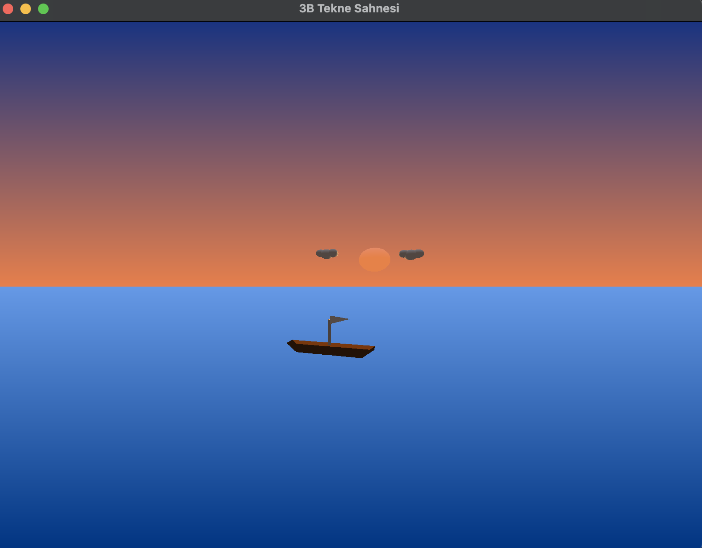

# 🚢 OpenGL – GLFW 3D Boat Scene

Bu proje, **OpenGL** ve **GLFW** kütüphaneleri kullanılarak geliştirilmiş, temel 3B grafik kavramlarını içeren etkileşimli bir **tekne sahnesi simülasyonudur**.  
Çalışmanın amacı; 3B nesne modelleme, sahne tasarımı, animasyon ve kullanıcı etkileşimini uygulamalı olarak göstermektir.

---

## 🖼️ Proje Önizleme

> Şekil 1. OpenGL kullanılarak oluşturulan 3B tekne sahnesi.

---

## 📋 Proje Özellikleri

- Tekne nesnesi, **birden fazla 3B temel geometrik şeklin** (küp, silindir, küre ve çizgisel yapılar) birleşimi kullanılarak modellenmiştir.  
  Bu sayede karmaşık bir 3B model, temel yapı taşları üzerinden oluşturulmuştur.

- Modelin parçaları **birbirinden bağımsız şekilde hareket edebilmektedir**.  
  Tekne üzerindeki bayrak, gövdeden bağımsız olarak animasyonlu biçimde hareket ederken; tekne modeli deniz yüzeyini temsil eden dalga hareketine uygun şekilde konum değiştirmektedir.

- Model, klavye girdileri aracılığıyla sahne içerisinde **ileri, geri, sağa ve sola** hareket ettirilebilmektedir.  
  Böylece kullanıcı ile sahne arasında etkileşim sağlanmıştır.

- Sahne içerisinde **birden fazla aydınlatma kaynağı** kullanılmaktadır.  
  Güneşi temsil eden ana ışık kaynağına ek olarak ortam (ambient) aydınlatması tanımlanmış ve sahnenin gerçekçi bir şekilde aydınlatılması sağlanmıştır.

- Arka plan, sahneye özel olarak tasarlanmıştır.  
  Sahne içerisinde **3B güneş**, **3B bulutlar**, **deniz yüzeyi** ve **gökyüzü** bileşenleri yer almakta olup görsel bütünlük desteklenmiştir.

- Kamera açısı kullanıcı girdileri ile kontrol edilebilmekte; böylece sahne içerisinde **farklı açılardan gezinerek** 3B çizimler detaylı bir şekilde incelenebilmektedir.

---

## 🛠️ Kullanılan Teknolojiler

- **C++**
- **OpenGL**
- **GLFW**
- **GLUT / GLU** (gereken durumlarda)
- **macOS**

---

## 📁 Proje Yapısı

